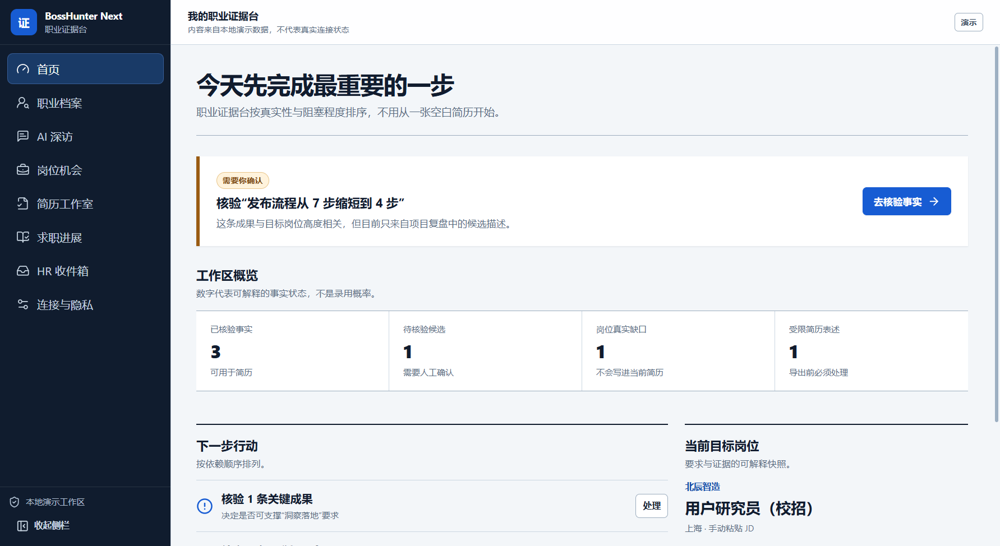

# BossHunter Next

[](https://github.com/yangwei251003/zhiyou/actions/workflows/quality.yml)
[](https://github.com/yangwei251003/zhiyou/releases)
[](LICENSE)

BossHunter Next 是一个 Windows 优先、local-first 的“职业证据操作系统”。它不从空白模板开始，
而是先把简历、项目复盘、成绩单、证书和 AI 深访整理成可核验的个人事实，再针对每个岗位生成
独立简历、证据缺口与学习计划。

> 当前状态：clean-room、Windows 未签名 alpha 预览。源码和便携运行包公开用于评估，但这不等于
> 稳定版、代码签名或开源授权。产品名、隐私、Codex 分发与招聘平台条款仍需正式审查。



## 下载并打开 Windows 预发布

前往 [GitHub Releases](https://github.com/yangwei251003/zhiyou/releases) 下载
`BossHunter-Next-0.1.0-alpha.1-windows-x64.zip` 和 `SHA256SUMS.txt`。先核对 SHA-256，完整
解压后双击 `BossHunter-Next.exe`；它不会安装自动更新，也不会捆绑 Codex。

其中的程序尚未代码签名，Windows SmartScreen 可能警告或阻止。不要绕过单位设备策略；无法确认哈希
或不能接受未签名预览风险时，请使用冻结锁文件从源码构建。完整范围见
[本版发布说明](docs/releases/v0.1.0-alpha.1.md) 与 [安全策略](SECURITY.md)。

## 已实现的完整主链路

1. 创建本机个人职业库；数据库与原始资料使用 AES-256-GCM 加密，密钥由系统安全存储保护。
   若系统不具备可信密钥保护且本机从未建立持久库，则明确进入“临时内存工作区”，要求单独确认并
   持续提示退出即丢失；若磁盘上已有加密库，则进入锁定状态，绝不以空内存库遮蔽旧资料。
2. 导入 PDF、DOCX、Markdown 或 UTF-8 文本；先在受内存与时间限制的一次性本机独立子进程中
   解析，绝不因“上传”自动调用 AI。单文件上限 10 MiB、提取文字上限 200 万 UTF-16 单元；
   DOCX 的全部 XML/RELS 在解压前接受声明量预筛，并在子进程内按实际解压输出执行 8 MiB
   聚合硬上限、CRC 和物理边界检查。
3. 用户逐次确认发送范围后，通过官方 Codex App Server 提取候选事实；候选必须人工核验。单次
   AI 操作最多发送 128 个片段、256 KiB JSON 上下文，超出时资料仍留在本机并要求拆分处理。
4. 通过苏格拉底式深访补充本人行动、限制与结果；AI 只能返回问题和待核验候选。
5. 粘贴 JD，拆解硬要求、偏好、职责和风险，并生成“岗位要求 → 已核验证据”矩阵。
6. 区分证据缺口和待学习项；没有导入证据不等于用户没有能力。
7. 从已核验事实生成岗位简历，或让 Codex 在不改变事实的前提下定制表述；任何偏离证据原句的
   AI 改写都必须由用户逐条确认且确认绑定完整文本，修改后自动失效。未确认改写以及无依据的
   新数字、日期、身份、技能或结果都不能导出。
8. 导出 ATS 纯文本或三种安全单栏 HTML 风格：解析优先、专业风格、校园项目型。
9. 查看 Codex 真实登录与额度状态；认证信息不进入 BossHunter 数据库或导出。
10. 完整导出个人数据与原始资料，或通过隔离目录、先销毁密钥再清理密文的方式永久删除当前本机职业库。

## 绝不静默跨越的边界

- AI 建议不是事实，模型信心和模型返回的隐藏结构字段也不是真实性；数字与日期白名单只从用户
  看得见并确认的事实文本确定性提取。
- 已核验事实的 AI 与简历权限可随时分别撤回；Codex 定制只读取同时获得两项授权的本次所选事实。
- 简历 claim 必须绑定当前已核验的事实版本；AI 不能直接投递或发消息。
- Codex 运行是 ephemeral、只读、结构化输出、无工具；检测到工具或服务端请求就中断。
- AI 上下文与 JSONL 协议行都有独立字节上限；畸形消息、超限消息或请求结果未知会关闭连接，
  并在进程树确认清理前阻止重试。
- 当前只在 Windows 连接 Codex：候选 `codex.exe`（包括用户显式选择的路径）必须通过
  Authenticode 验证，签名状态为 `Valid`，且证书 `CN` 与 `O` 都精确等于
  `OpenAI OpCo, LLC`，并终止于固定 SHA-256 指纹的 Microsoft 身份验证根。验签代理从
  Windows 内核 `SystemRoot` 命名空间定位，不信任环境变量；它锁住固定卷目录链与目标文件，
  在锁内复验后才启动，并用 kill-on-close Job 管理整棵进程树。并发状态请求只启动一个 App
  Server，初始化前不暴露连接；停止结果不确定会锁死本次运行，绝不重复启动。其他系统安全停止。
- 生产 renderer 的 CSP 固定为 `connect-src 'none'`；只有开发服务器构建会注入本机回环
  HTTP/WebSocket 地址。
- BOSS 的自动登录、采集、开聊、投递、发简历和回复默认不可达。只有取得官方授权、完成最新
  条款与法律审查后，才可能针对单项能力解锁；验证码绕过、指纹规避和无人批投永不实现。
- 不宣传统一“ATS 分数”、保证面试率或把旧的“7.4 秒”眼动研究当成普遍定律。
- 可信启动防 PATH 冒名和文件竞争，不承诺抵抗已攻陷的当前 Windows 账户或管理员；公开发布前
  仍需把私测的系统 PowerShell/内存 C# 句柄代理替换为签名、可复现构建的原生 broker。

## 本地开发

要求 Node.js 22.12+ 与 pnpm 10.33.2。

```text
pnpm install --frozen-lockfile
pnpm dev
pnpm quality
pnpm test:coverage
pnpm test:e2e
pnpm package:win
pnpm test:packaged
pnpm test:windows-trust
pnpm audit --audit-level high
```

`pnpm quality` 会运行所有包的严格类型检查、Lint、单元/集成测试与生产构建。Electron E2E 使用
隔离的临时用户目录，不访问真实 Codex 账号，也不会消耗账号额度；其测试钩子在打包版本中
不可启用。`pnpm test:coverage` 使用仓库声明的 V8 覆盖率组件执行各工作区覆盖率测试；CI 也会
执行该命令。GitHub Actions 均固定到完整提交 SHA，Windows E2E 证据保留 14 天。
`pnpm test:windows-trust` 是 Windows 真机门禁：只读取 Codex 账号与额度可用状态，不请求生成，
先让当前 broker 逐字节等价地转发至少 10 MiB 单行 JSONL 并核对 SHA-256/5 秒性能门槛，随后
强制退出父进程，以验证受控 PowerShell、Codex 与其辅助进程全部被 Job 自动回收。
当前 Alpha 使用 Electron 44 稳定版；依赖审计不得保留 high/critical 级已知漏洞。

## 当前已知限制

- 图片和扫描 PDF 会明确进入 `needs_ocr`，OCR 适配器尚未实现，不会让模型猜图中文字。
- HTML 可直接打印为 PDF；原生 PDF/DOCX 导出与导出后回读测试仍是后续里程碑。
- 第三方文档解析器已从 Electron main 隔离到一次性 Electron utility process，使用 192 MiB
  V8 老生代参数、15 秒看门狗和单并发队列；每次结果返回前必须确认子进程退出，无法确认就锁死
  本次运行的后续解析。公开发布前仍需在签名构建上完成更多敌意 PDF/DOCX 语料和系统级资源测试。
- 单次事实提取不会自动分批：超过 128 个片段或 256 KiB AI 上下文的资料需要用户先拆分；这是
  防止上下文溢出和意外额度消耗的私有 alpha 限制，不影响原文件留在本机职业库。
- 当前只提供未签名 Windows x64 便携预览；签名安装器、验证更新与正式分发链路尚未提供。
- 个人事实的争议、删除、合并和资料恢复 UI 尚未完成。
- 求职进展和 HR 收件箱在个人模式中保持关闭说明；不会把演示消息伪装成真实平台数据。
- 没有云同步、移动端、向量数据库、无人值守平台自动化或跨设备备份。
- 屏幕阅读器覆盖完整主流程仍需在签名 Windows 构建上人工验收；现有自动化不能替代该门禁。
- “永久删除”只覆盖 BossHunter 当前本机职业库，不会删除用户先前导出的明文、系统备份、
  文件系统快照或存储介质的历史块。

## 设计与审查资料

- `docs/product-contract.md`：不可变产品语言与主旅程
- `docs/research-evidence.md`：招聘方、学生痛点、ATS 与平台条款的证据基线
- `docs/original-project-audit.md`：原项目审计与 clean-room 决策
- `docs/architecture.md`：当前真实架构与未完成门禁
- `docs/threat-model.md`：威胁模型
- `docs/quality-gates.md`：自动化与人工发布门禁
- `LEGAL.md`：品牌、分发、隐私与平台条款状态
- `SECURITY.md`：私密漏洞报告与支持范围
- `THIRD_PARTY_NOTICES.md`：生产依赖许可概览
- `docs/releases/v0.1.0-alpha.1.md`：首个 Windows 预发布说明
